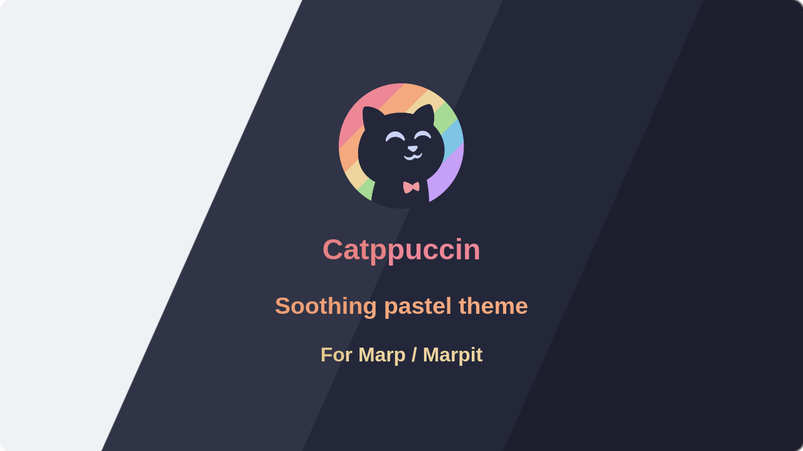
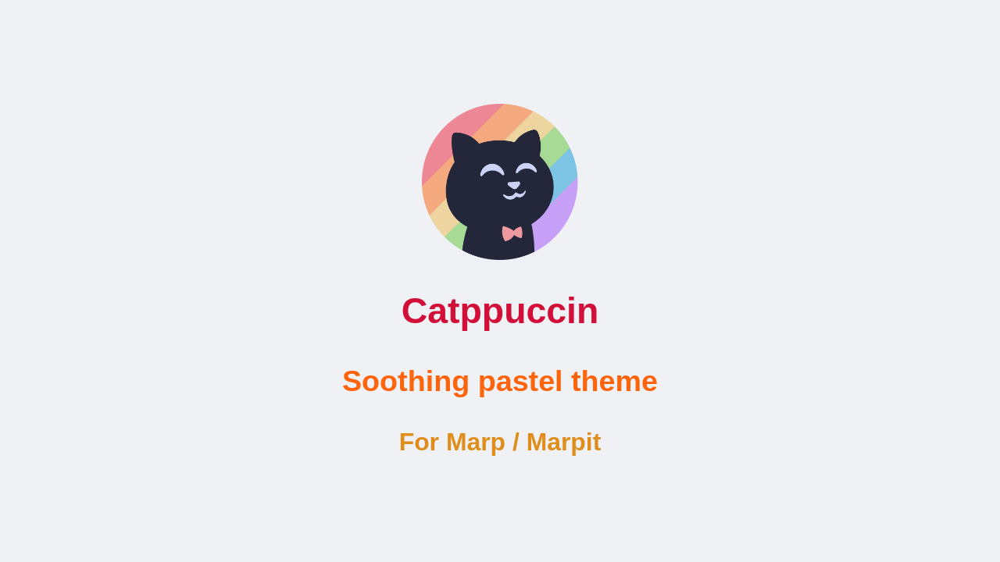
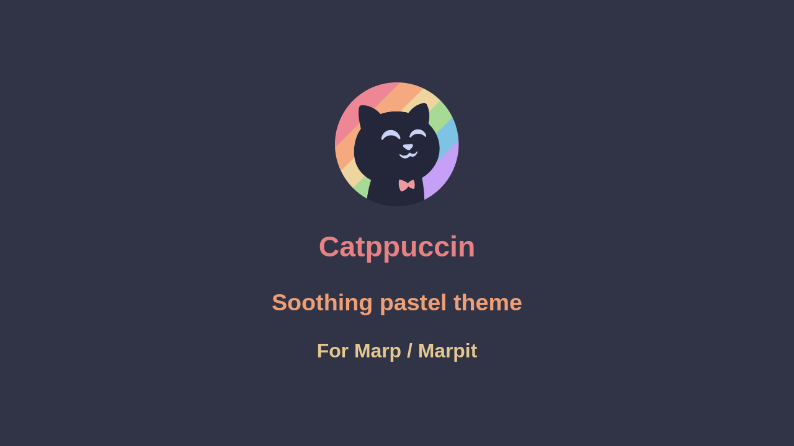
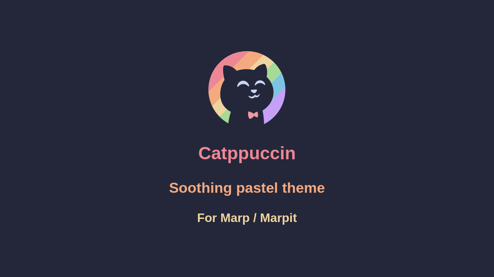
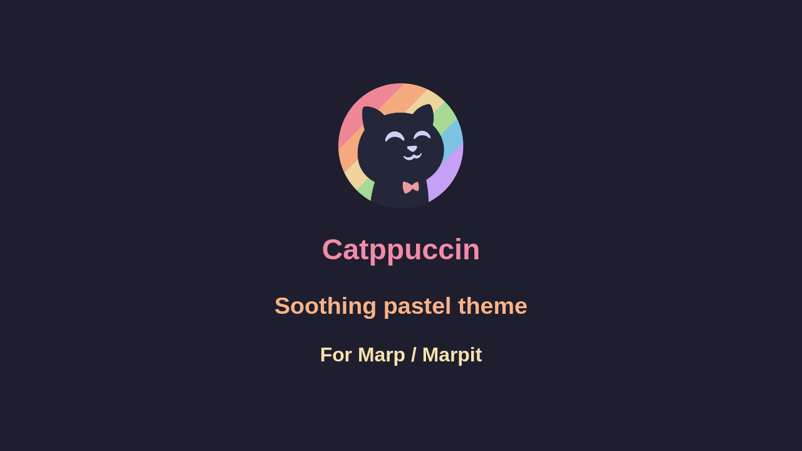

<h3 align="center">
	<br/>
	
	Catppuccin for <a href="https://marpit.marp.app">Marpit</a>
	
</h3>

<p align="center">
	<a href="https://github.com/nicolas-goudry/marp/stargazers"></a>
	<a href="https://github.com/nicolas-goudry/marp/issues"></a>
	<a href="https://github.com/nicolas-goudry/marp/contributors"></a>
</p>

<p align="center">
	
</p>

## Previews

<details>
<summary>🌻 Latte</summary>

</details>
<details>
<summary>🪴 Frappé</summary>

</details>
<details>
<summary>🌺 Macchiato</summary>

</details>
<details>
<summary>🌿 Mocha</summary>

</details>

## Usage

To use this theme, you just need to reference one of the generated CSS files and declare the theme in your Markdown frontmatter.

1. Create a markdown file for your presentation (e.g., `slide.md`).
2. Add the appropriate Catppuccin flavor to your Marpit frontmatter:

```md
---
theme: catppuccin-mocha
---

# Catppuccin Marp

Welcome to my soothing presentation!

---

<!-- _class: lead -->

## Centered Slide

This theme also ports the built-in Marp "lead" class for centered content!
```

### Option A: Using Marp CLI

You can load the custom themes into the [Marp CLI](https://github.com/marp-team/marp-cli) using command-line flags or a configuration file. 

#### 1. Command-Line flags

**Make a single theme available:**

```bash
# Point directly to a specific CSS file.
marp --theme-set themes/catppuccin-mocha.css -- slide.md
```

**Make all flavors available:**

```bash
# Point to the entire directory to load all 4 flavors, allowing you to easily switch between them in your Markdown frontmatter.
marp --theme-set themes -- slide.md
```

> [!NOTE]
>
> **Passing a theme via `--theme-set` does _not_ automatically apply it.**
>
> It simply makes the theme available for Marp to consume if you've declared it in your Markdown's frontmatter (e.g., `theme: catppuccin-mocha`).

**Force a theme (override frontmatter):**

If you want to completely ignore the `theme:` declaration in your Markdown file and force a specific flavor, use the `--theme` flag instead.

```bash
marp --theme themes/catppuccin-mocha.css -- slide.md
```

#### 2. Using a configuration file

If you prefer not to type flags every time, you can define your active themes in a [Marp configuration file](https://github.com/marp-team/marp-cli#configuration-file).

Here is an example `.marprc` (using YAML format) that registers the entire `themes` directory and sets Mocha as the default theme:

```yaml
# .marprc
themeSet:
  - themes
# Optional: force this theme on all slides, overriding frontmatter
theme: catppuccin-mocha
```

Then, you can simply run Marp CLI pointing to your config:

```bash
marp --config-file marp.config.yml slide.md
```

### Option B: Using Marp for VS Code

If you use the [Marp for VS Code Extension](https://marketplace.visualstudio.com/items?itemName=marp-team.marp-vscode), you can configure it to globally recognize the Catppuccin themes.

1. Download the `themes/` folder to your workspace.
2. Open your VS Code `settings.json` (Workspace or Global).
3. Add the paths to the Catppuccin CSS files under `markdown.marp.themes`:

```json
{
  "markdown.marp.themes": [
    "./themes/catppuccin-latte.css",
    "./themes/catppuccin-frappe.css",
    "./themes/catppuccin-macchiato.css",
    "./themes/catppuccin-mocha.css"
  ]
}
```

Now, typing `theme: catppuccin-mocha` in your markdown file will instantly apply the theme in the VS Code preview panel!

## Development

This project uses [Whiskers](https://whiskers.catppuccin.com) to dynamically generate the 4 Catppuccin flavors. To build locally:

1. Clone the repository: `git clone https://github.com/nicolas-goudry/marp.git`
2. [Install Whiskers](https://whiskers.catppuccin.com/getting-started/installation/)
3. Build the themes: `whiskers marp.tera`
4. The generated `.css` files will be placed in the `themes/` directory.

## 💝 Thanks to

- [Marp Team](https://github.com/marp-team) for the amazing presentation framework.
- [Nicolas Goudry](https://github.com/nicolas-goudry)

&nbsp;

<p align="center">
	
</p>

<p align="center">
	Copyright &copy; 2021-present <a href="https://github.com/catppuccin" target="_blank">Catppuccin Org</a>
</p>

<p align="center">
	<a href="https://github.com/catppuccin/catppuccin/blob/main/LICENSE"></a>
</p>
